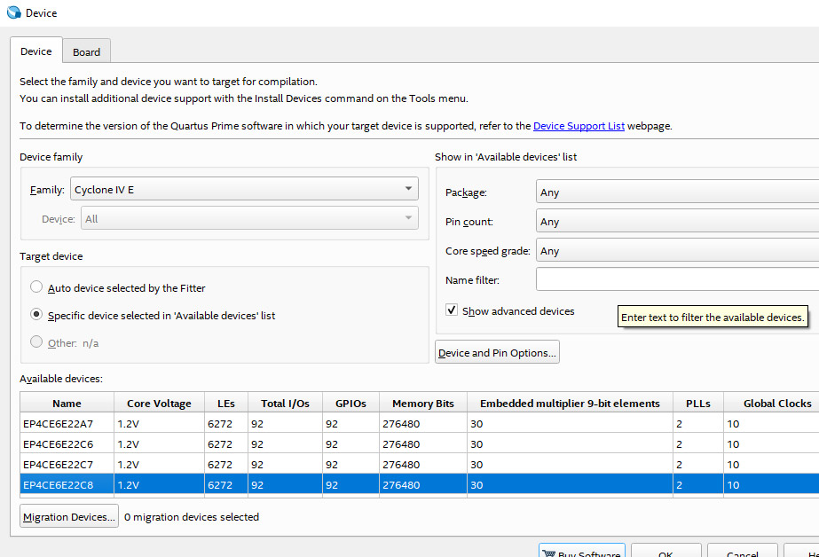
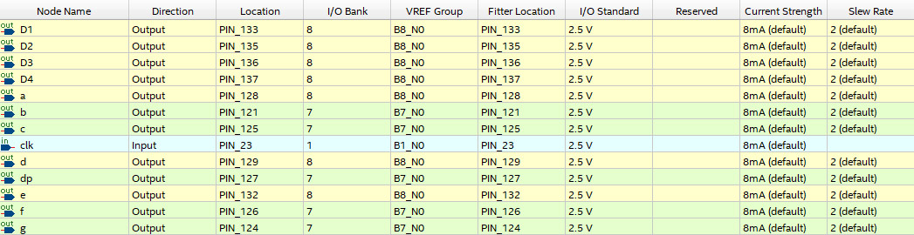

# Cyclone IV FPGA Seven Segment Display Example

Example cycles some lighting patterns using the 4 panel Seven Segment Display on the Cyclone IV FPGA EP4CE6E22C8N.

## Device Settings

## Pin Assignments

